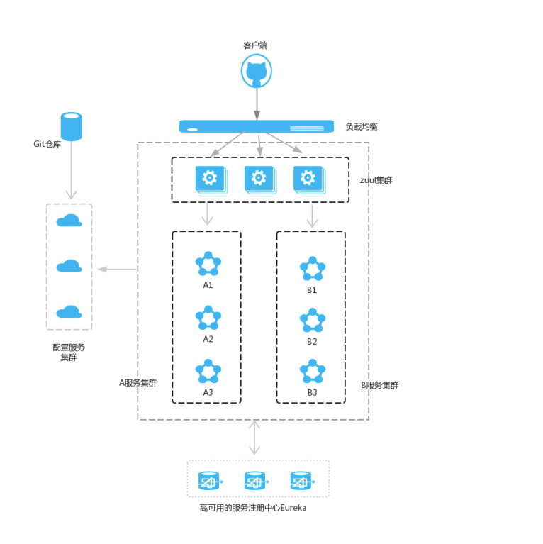
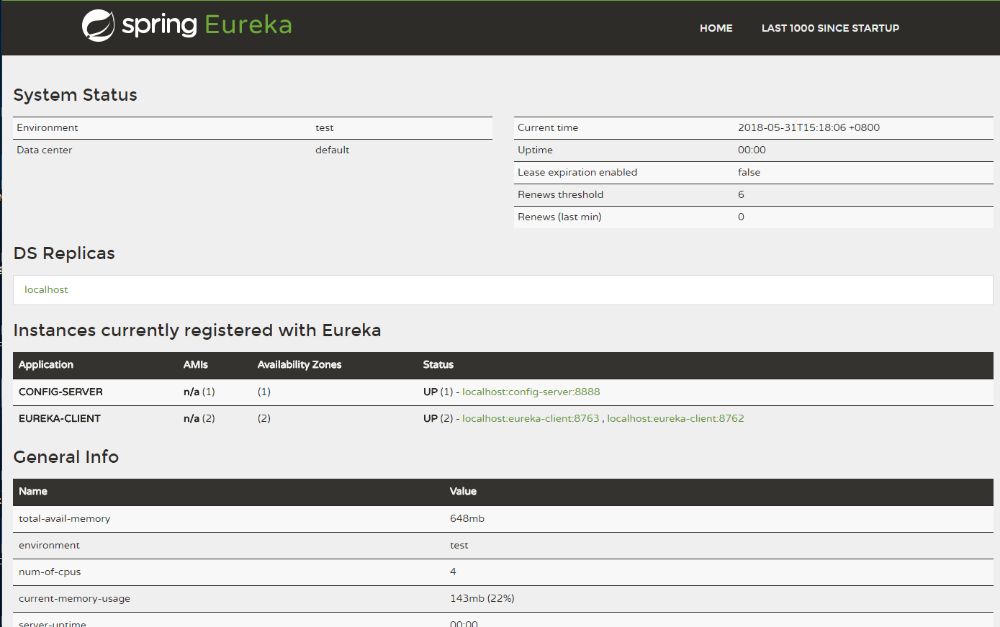
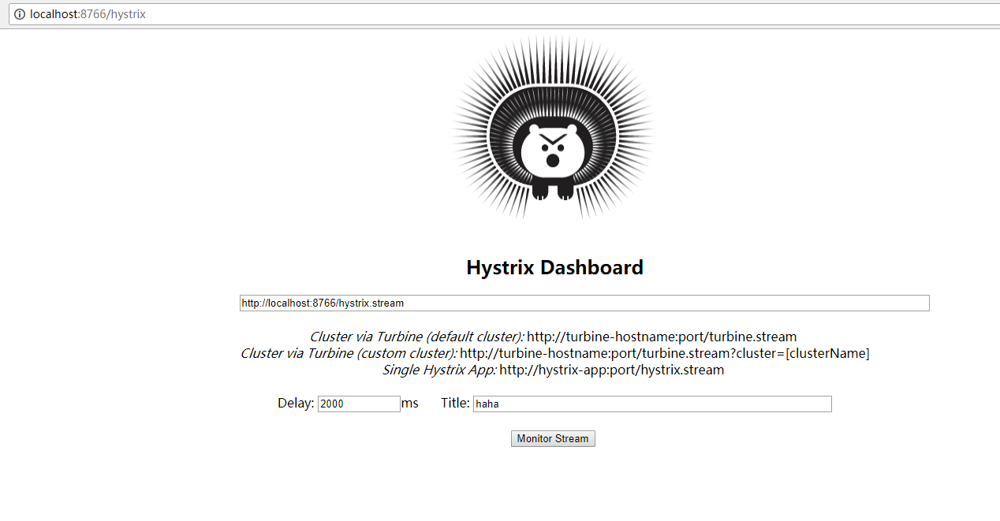
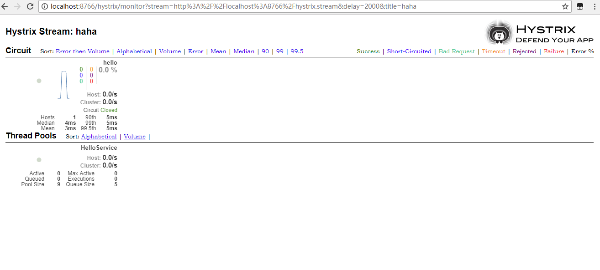

#spring cloud 框架

## 微服务架构

 
 
## 工作内容
        搭建基于最新版本（spring boot2.1, spring cloud RC1版本）的微服务框架，解决了惨考资料
    的一些bug, 和老版本与最新版本不兼容的问题。
 
## 组织结构
        mbootcloud
        ├── eureka-server -- Netflix Eureka服务注册中心      [端口 8761]
        | 
        ├── eurekaclient -- 服务消费(模拟服务)
        |	├── micro-serviceA -- 服务消费A[端口 8762] 
        |	├── micro-serviceB -- 服务消费B[端口 8763] 
        |
        |———micro-loadbalanced  --服务分发（负载均衡）  
        |	├── ribbon-consumer --服务分发（rest+ribbon） [端口 8764] 	
        |	|── feign-server  --服务分发（feign）       [端口 8765] 
        |
        |── micro-hystrix- -- 服务分发（负载均衡)[断路器\服务消费+（Hystrix)+(Hystrix 仪表盘)]
        |	├── ribbon-hystrix -- (ribbon+hystrix)  [端口 8766] 
        |	├── feign-hystrix  -- (feign+hystrix)   [端口 8765]
        |
        |── micro-route-zuul  --路由网关(zuul)            [端口 8401] 
        |
        |── micro-config  --  分布式配置中心（高可用的分布式配置中心）(Spring Cloud Config)
        |	├── micro-config-client --配置中心服务端Config Server [端口 8401] 	
        |	|── micro-config-server --配置中心服务端Config Client [端口 8402] 
        |
        |── micro-sleuth-samples  --   服务链路追踪(Spring Cloud Sleuth)
        |	├── micro-server-zipkin  --zipkin数据收集中心  [端口 8501] 	
        |	|── micro-zipkin-serverA --模拟暴露服务A [端口 8502] 
        |	|── micro-zipkin-serverB --模拟暴露服务B [端口 8503] 
        |
        |── micro-eureka-server-cluster  --高可用的服务注册中心 (micro-eureka-server-cluster 多分配置)
        |	|── eureka-server-cluster --Eureka注册中心 [端口 8111] 
        |	|── eureka-server-cluster --Eureka注册中心 [端口 8112] 

 
 
## 模块视图简介
### 注册中心
   
   
### hystrix 仪表盘
   
       
 
## reference
 https://blog.csdn.net/forezp/article/details/70148833